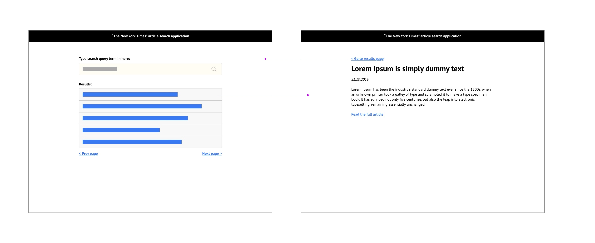

# The New York Times API fetch with React

The task is about implementing an article search application using The New York Times (NYT) public API.

It should have:

    - A main screen, where a user can search for articles, and view search results;
    - A detailed article view screen;

### User flow

1. The example design below.



## Starting point

1. First, clone this repo:

```console
$ git clone https://github.com/diegotauchert/nyt-fetch-api.git
```

### `Docker`

run `make deploy_dev` to deploy the app to a local Docker container.

then, run `make start` to run the app in the container.

### `Node`

### ` Tested only on node.js v16.14.0 `

Run the command below to install the dependencies.

### `yarn install`

After installed, run the project with `yarn start`.

### `yarn start`

Runs the app in the development mode.
Open [http://localhost:3000](http://localhost:3000) to view it in your browser.

The page will reload when you make changes.
You may also see any lint errors in the console.

### `yarn test`

Launches the test runner in the interactive watch mode.\

## Vscode

- Install `eslint` extension
- Install `prettier` extension
- Restart the IDE

Full Read:

[https://developers.grover.com/frontend-task/](https://developers.grover.com/frontend-task/)